# cloudrun-tf-demo
A Terraform example for launching a (Knative) Serverless CI/CD pipeline leveraging Google Cloud Run, Cloud Build and Google Container Registry (GCR) services.
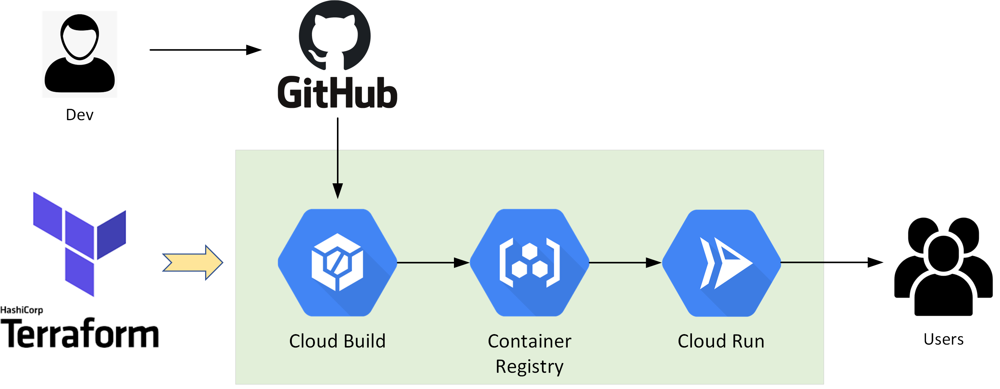


## Prerequisites
* Access to a GCP envrionment
* Install Git, GCloud SDK & Terraform 
* Check NTP sync status on your client!
* Clone this repo and update the variables in terraform.tfvars as per your speicifc environment 
```
git clone https://github.com/sc13912/cloudrun-tf-demo.git
```
* Download or fork the demo app (including the cloudbuild.yaml file) and then upload it to your own repo
```
https://github.com/sc13912/cloudrun-demo-app.git
```

## Step-1: Prepare the GCP Envrionment
### Configure GCloud Authentication
```
gcloud init
gcloud config set accessibility/screen_reader true
gcloud auth application-default login
gcloud auth configure-docker
gcloud config get-value project
```

### Enable Required GCP APIs
```
gcloud services enable servicenetworking.googleapis.com
gcloud services enable cloudresourcemanager.googleapis.com
gcloud services enable cloudbuild.googleapis.com
gcloud services enable containerregistry.googleapis.com 
gcloud services enable run.googleapis.com 
gcloud services enable sourcerepo.googleapis.com    
```

### Update Cloud Build service account permissions
```
PROJECT_ID=`gcloud config get-value project`
CLOUDBUILD_SA="$(gcloud projects describe $PROJECT_ID --format 'value(projectNumber)')@cloudbuild.gserviceaccount.com"
gcloud projects add-iam-policy-binding $PROJECT_ID --member serviceAccount:$CLOUDBUILD_SA --role roles/editor
gcloud projects add-iam-policy-binding $PROJECT_ID --member serviceAccount:$CLOUDBUILD_SA --role roles/run.admin
gcloud projects add-iam-policy-binding $PROJECT_ID --member serviceAccount:$CLOUDBUILD_SA --role roles/container.developer
```


## Step-2: Authorise Cloud Build to access your Github Repo for creating pipeline triggers
* Install the Github Cloud Build App (if not already)
```
https://github.com/marketplace/google-cloud-build
```

* Configure the Cloud Build App at *Settings* --> *Applications*
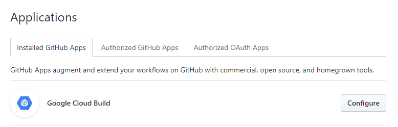

* Connect the GCP project and grant Cloud Build permissions to access your Github Repo
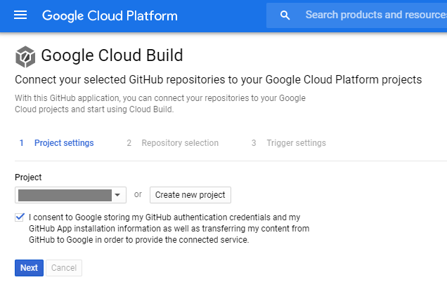

* Select the demo app repository, for now we'll skip creating the trigger as this will be performed by Terraform 
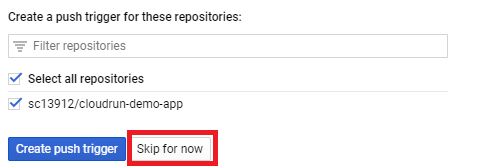


## Step-3: Run the Terraform script to launch a CICD envrionemnt
* Terraform will create a Cloud Run service and a Cloud Build trigger which links to the Github demo app repo with pre-configured pipeline file (cloudbuild.yaml)
``` 
terraform init && terraform apply
``` 

* Your terraform output should look like this
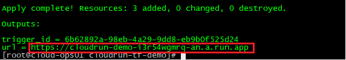

* Now access the Cloud Run service URL, which should be hosting a default demo app <gcr.io/cloudrun/hello> to begin with
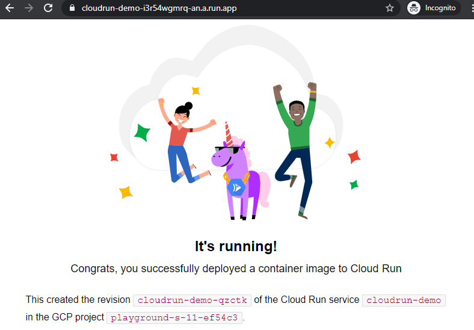

* Verify the Cloud Run service deployment status at the GCP console
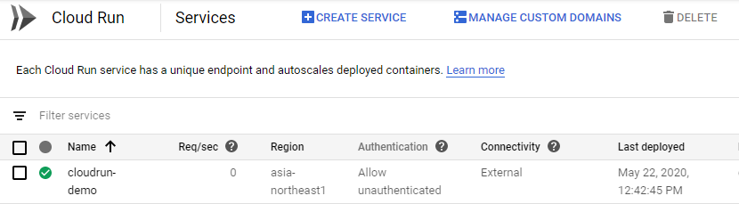

* We can also verify the Cloud Build trigger has been created successfully 
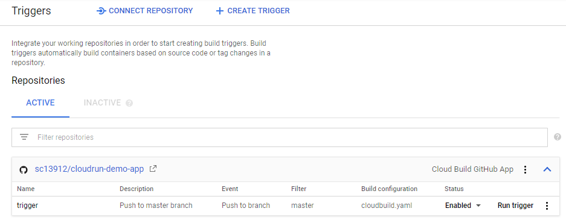


## Step-4: Test the Cloud Build pipeline 
* Make a Git push from the demo app repo
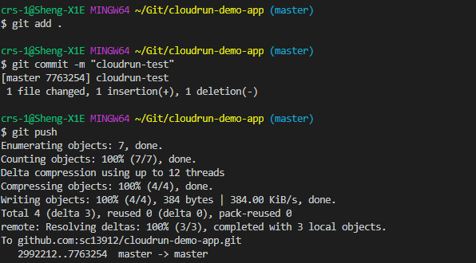

* Verify the pipeline has been trigged and monitor the build/deployemnt process


* Once the pipeline has been successfully completed, you should see the Cloud Run service has been updated with a new GCR hosted image that was built and pushed through by the Cloud Build moments ago. 
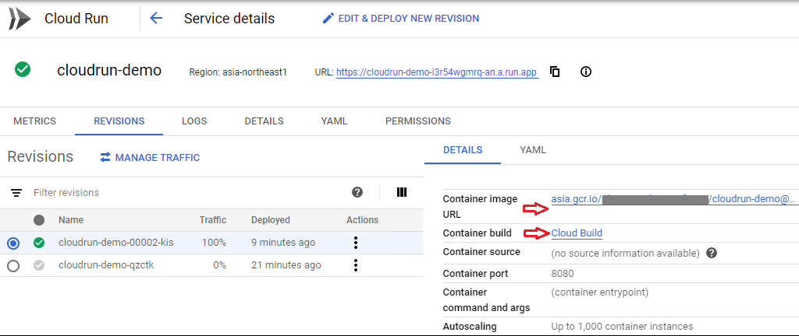

* Refresh the same URL and you should see our demo app is now running on Cloud Run!
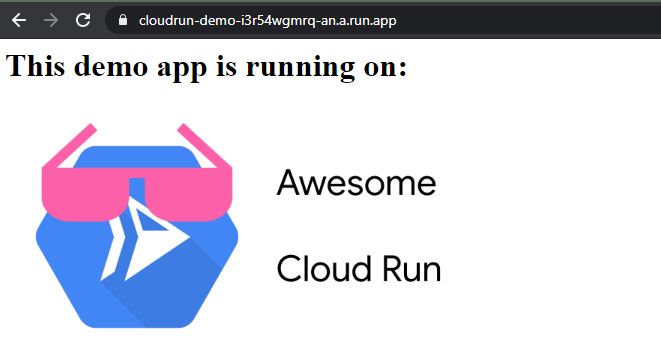

